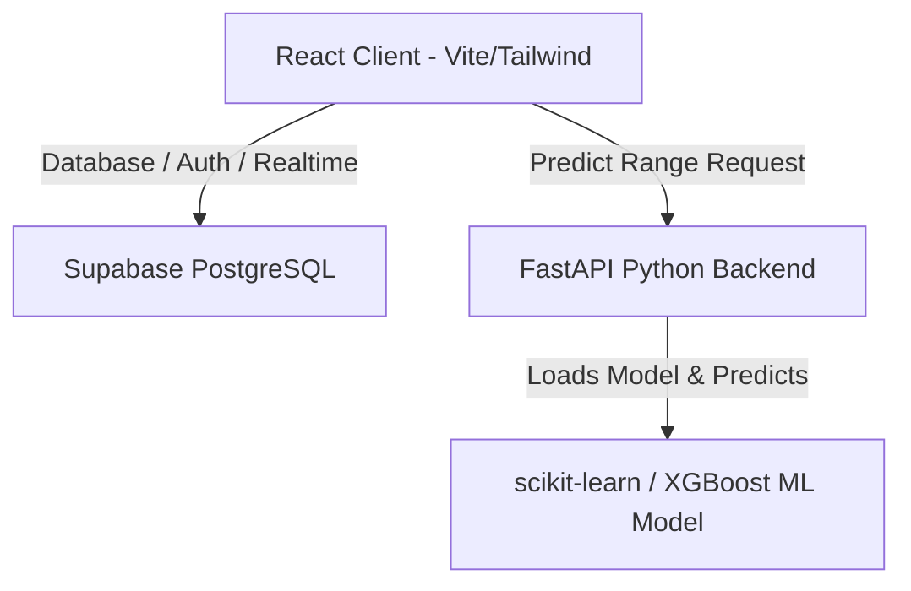

# ⚡ EV Fleet Management Platform

An advanced, premium-tier **Electric Vehicle (EV) Fleet Management & Analytics Platform**. The application features an interactive React-based admin/driver frontend, a FastAPI Python ML backend, and a real-time database powered by Supabase (PostgreSQL).

---

## 🏗️ Architecture & Component Overview



### 1. React Frontend (Vite)
* **Design & Aesthetics**: Sleek dark-mode dashboard, harmonized HSL-tailored color palettes, custom glassmorphic elements, and micro-animations powered by **Framer Motion** and **Lucide React**.
* **Maps & Navigation**: Powered by the **TomTom Maps Web SDK**, supporting live coordinate plotting, route matching, and geocoding.
* **Role-Based Workspaces**:
  * **Admin Dashboard**: View live fleet metrics, monitor alerts in real-time, analyze driver behaviors, and run comparative performance analytics charts (built with **Recharts**).
  * **Driver Dashboard**: Input parameters (Battery, SOH, Speed, Charge Cycles, Odometer) and utilize the ML-powered predictor to determine trip feasibility and recommended charging stations.

### 2. FastAPI Python Backend
* Serves as the Machine Learning routing service for range prediction.
* Orchestrates and exposes endpoints such as `/api/predict` and `/api/health`.
* Dynamically executes routing calculations and plans charging stops based on estimated battery consumption along the TomTom route path.

### 3. Machine Learning (ML) Engine
* **Gradient Boosting Regressor** trained on a comprehensive EV telematics dataset (`daata.csv`).
* Predicts remaining EV range (km) based on real-time vehicle metrics.
* **Features Used for Inference**:
  * `Current Battery Level (%)`
  * `Vehicle Weight (kg)`
  * `Current Speed (km/h)`
  * `Battery Temperature (°C)`
  * `City/Highway_enc` (Encoded using fitted label encoders)
* Includes automated retraining fallbacks if pickle versions mismatch the system environment.

### 4. Supabase Backend
* **Auth**: Secure email-password credentials with role-based JWT claims.
* **Database**: PostgreSQL schema containing tables for `vehicles`, `drivers`, `trips`, `alerts`, `charging_stations`, and `revenue_snapshots`.
* **Triggers & Functions**: Auto-inserts profile records, auto-syncs user roles, and handles live vehicle status updates.
* **Realtime**: Live updates for alerts and vehicle telematics utilizing Supabase postgres changes channels.

---

## 📂 Project Directory Structure

```text
ev-fleet-management/
├── backend/                  # FastAPI Python backend
│   ├── services/             # Core service modules (ML Predictor, Route planner)
│   │   ├── charging_service.py
│   │   ├── model_service.py
│   │   ├── range_predictor.py
│   │   └── route_service.py
│   ├── main.py               # API endpoints and startup handlers
│   ├── start.py              # Server run configuration
│   └── requirements.txt      # Python dependencies
├── ML/                       # Machine Learning codebase
│   ├── daata.csv             # Training dataset
│   ├── predict_range.py      # Retraining & model evaluation script
│   └── range_model.pkl       # Serialized regressor model + encoders
├── src/                      # React frontend codebase
│   ├── components/           # Reusable widgets (maps, layouts, shared UI)
│   ├── context/              # AppState, Auth, and Realtime Providers (AppContext)
│   ├── layouts/              # Parent route wrappers (AdminLayout, DriverLayout)
│   ├── lib/                  # DB query interface and Supabase SDK client
│   └── pages/                # Workspace views (DriverAnalytics, RangePrediction, Dashboard)
├── supabase/                 # Database schema migrations & seeds
│   ├── schema.sql            # Core SQL layout & tables
│   ├── seed_data.sql         # Standard fleet seed data
│   └── link_seeded_drivers_auth.sql # Helper script to create accounts for seeded drivers
├── .env                      # Global environment configurations
├── package.json              # Frontend dependencies and Vite scripts
└── README.md                 # Project documentation
```

---

## ⚙️ Local Installation & Setup

### Prerequisites
* **Node.js** (v18+)
* **Python** (3.9 - 3.11)
* **Supabase Account / Project**

### 1. Database Setup (Supabase)
1. Go to your **Supabase Workspace** → **SQL Editor**.
2. Run the schema script located in [schema.sql](file:///d:/EV_Fleet_final_frontend/EV_Fleet/ev-fleet-management/supabase/schema.sql) to set up tables, triggers, and Row Level Security (RLS) rules.
3. Run [seed_data.sql](file:///d:/EV_Fleet_final_frontend/EV_Fleet/ev-fleet-management/supabase/seed_data.sql) and [seed_all_drivers_force.sql](file:///d:/EV_Fleet_final_frontend/EV_Fleet/ev-fleet-management/supabase/seed_all_drivers_force.sql) to populate simulated historical metrics.
4. Copy and execute [link_seeded_drivers_auth.sql](file:///d:/EV_Fleet_final_frontend/EV_Fleet/ev-fleet-management/supabase/link_seeded_drivers_auth.sql) to register login credentials for all simulated drivers (Default password: `password123`).

### 2. Environment Configuration
Create a `.env` file in the root directory:
```env
# Supabase Configuration
VITE_SUPABASE_URL=https://your-supabase-project.supabase.co
VITE_SUPABASE_ANON_KEY=your-supabase-anon-key
SUPABASE_SERVICE_ROLE_KEY=your-supabase-service-role-key

# TomTom Maps SDK
VITE_TOMTOM_API_KEY=your-tomtom-api-key

# ML Backend Endpoint
VITE_BACKEND_URL=http://localhost:8000
```

### 3. FastAPI ML Backend Setup
1. Open a terminal and navigate to the project directory:
   ```bash
   cd backend
   ```
2. Install Python packages:
   ```bash
   pip install -r requirements.txt
   ```
3. Run the development server:
   ```bash
   python -m backend.start
   ```
   *(API will spin up on `http://localhost:8000`)*

### 4. React Frontend Setup
1. Navigate to the project root:
   ```bash
   npm install
   ```
2. Run Vite's local dev server:
   ```bash
   npm run dev
   ```
3. Open your browser to `http://localhost:5173`.

### 5. Retraining the ML Model
If you ever update the training dataset or make improvements to the ML algorithm:
1. Navigate to the root directory.
2. Run the retraining script:
   ```bash
   python ML/predict_range.py
   ```
   This script evaluates multiple models (Gradient Boosting, Random Forest, XGBoost, Neural Networks, Ridge), prints comparative evaluation metrics (R² and MAE), picks the highest performer, and serializes it directly into `ML/range_model.pkl`.

---

## 🔒 Security & Optimization Controls
* **Row-Level Security (RLS)**: Enforced on all Supabase tables. Admins have access to write/modify data; drivers are limited strictly to reading metrics associated with their own `profile_id`.
* **Validation Bounds**: Frontend inputs are capped in real-time to prevent out-of-bounds inputs:
  * Battery SOH: `0% - 100%`
  * Battery Level: `0% - 100%`
  * Vehicle Speed: `0 - 200 km/h`
  * Charge Cycles: `0 - 3000`
  * Odometer: `0 - 500,000 km`
* **Input Sanitization**: Numeric inputs automatically intercept and discard invalid formatting characters (e.g. `+`, `-`, `e`) at keydown.
